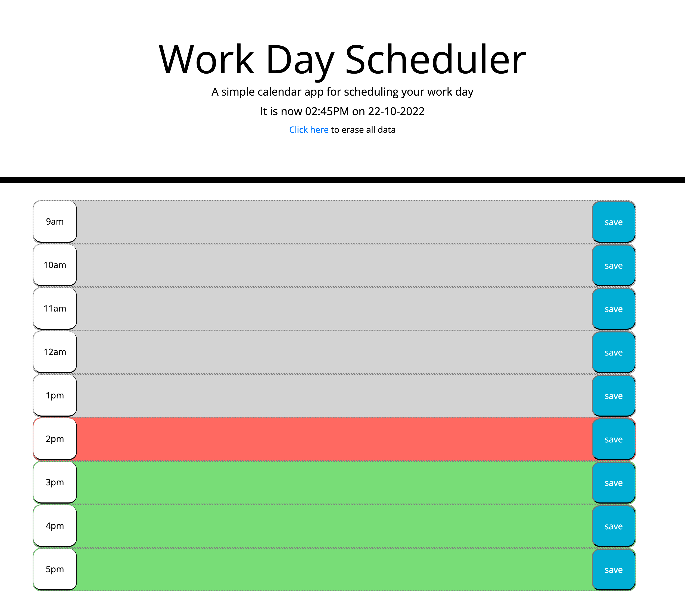

# Work Day Scheduler
### A javascript-based daily planner

This repository is for a single-page daily work planner made for my UC Berkeley coding bootcamp. It allows the user to view and edit a daily planner for 9-5 work hours. Entries are stored in the browser's local data and can be cleared on request.

The website is live on github pages [and can be viewed here.](https://studiomav.github.io/work-day-scheduler/)

If all is well, the page should display like in this screenshot:

There is no license for this project and it is intended for educational purposes only.